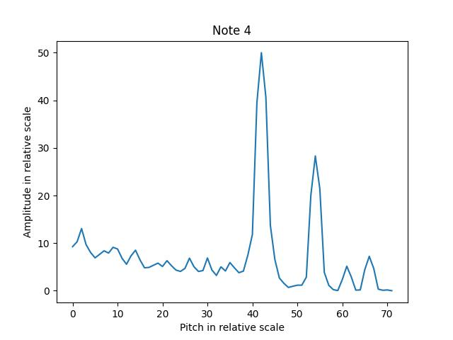

# Pitch_Identification
Identify a single clear note of the D-major Guzheng
 

<b>Guzheng note table</b>

<h2 style="clear: both;">How I implemented this program</h2>
    <ul>
        <li>First using Fourier transformation to get the pitch spectrum, which is shown above.
            <ul>
                <li>A little explanation: the leftmost peak with a high prominence is usually the pitch of the note. This pattern could actually be easily seen with bare eyes. </li>
            </ul>
        </li>
        <li>Second using the peak detection algorithm to find the first peak with a high prominence. Done!</li>
        <ul>
            <li>I've tried other machine learning algorithms to identify the pattern. But later I found that a simple rule-based peak detection algorithm works best.</li>
        </ul></ul>

<h2 style="clear: both;">Pitch Spectrum of 21 notes (The leftmost peak with a high prominence is the pitch.)</h2>

    
    
    
    
    
    
    
    
    
    
    
    
    
    
    
    
    
    
    
    
    
 

